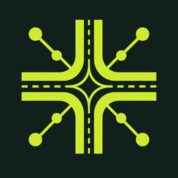
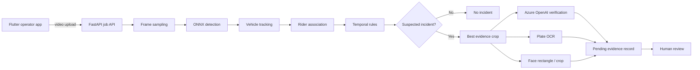

<div align="center">
  

  # STMS

  **Human-reviewed smart traffic intelligence for Indian roads**

  
  
  
  
</div>

STMS is a Flutter operator application and FastAPI video-analysis service for detecting, enriching and reviewing suspected traffic violations. It combines local ONNX tracking with Azure OpenAI visual verification and optional Azure Face detection.

> [!IMPORTANT]
> STMS produces **advisory incident candidates**, not automatic fines or enforcement decisions. Every incident requires human review. Camera-specific calibration, representative validation data and the appropriate legal authority are required before any real-world deployment.

## Contents

- [Capabilities](#capabilities)
- [How it works](#how-it-works)
- [Technology](#technology)
- [Repository structure](#repository-structure)
- [Quick start](#quick-start)
- [Azure enrichment](#azure-enrichment)
- [API](#api)
- [Configuration](#configuration)
- [Testing](#testing)
- [Docker and Azure deployment](#docker-and-azure-deployment)
- [Privacy and responsible use](#privacy-and-responsible-use)
- [Known limitations](#known-limitations)
- [Contributing](#contributing)

## Capabilities

### Operator experience

- Responsive Android, phone, tablet and desktop-style control-room interface
- Recorded-video upload with live job progress
- Searchable evidence queue and review status filters
- Evidence frame, vehicle, plate and rider-face crops
- Vehicle intelligence workspace with OCR search, crop review and a guarded DataFlag integration state
- Azure-generated vehicle description, colour, probable make/model and uncertainty
- Explicit approve, reject and needs-review workflow with operator notes
- Privacy-conscious evidence presentation

### Detection pipeline

| Capability | Current implementation | Operational note |
|---|---|---|
| No helmet | ONNX temporal detection with Azure contradiction checks | Motorized two-wheelers only |
| Triple riding | Exclusive person-to-motorcycle association, temporal consensus and Azure rider-count veto | Requires multiple consistent frames |
| Wrong-side driving | Dominant-flow analysis for fixed cameras | Disabled until direction calibration is enabled |
| Ambulance obstruction | Ambulance text detection plus stationary-vehicle corridor analysis | Experimental; requires a calibrated fixed camera |
| Licence plate | Plate localization, evidence crop and local OCR | Readability depends on angle, motion and resolution |
| Rider face crop | Azure Face rectangle detection with local fallback | Detection/cropping only; no identification |
| Vehicle attributes | Azure OpenAI evidence-frame enrichment | Estimates are shown with confidence and uncertainty |

The local models inspect actual video pixels. They are suitable for development and human-reviewed demonstrations, but not a substitute for a validated production model.

## How it works



Azure is a selective second-opinion layer. STMS sends only the best evidence crop for a suspected incident instead of sending every video frame. A confident Azure result may reject an obvious contradiction—for example, a bicycle locally classified as a motorcycle—but it does not independently create an enforcement action.

## Technology

| Layer | Technology |
|---|---|
| Mobile/operator UI | Flutter, Dart, Material 3 |
| API | FastAPI, Pydantic, Uvicorn |
| Video processing | OpenCV |
| Local inference | ONNX Runtime, YOLO-compatible models |
| OCR | RapidOCR |
| Cloud enrichment | Azure OpenAI vision models |
| Face crop | Azure AI Face Detect with local OpenCV fallback |
| Authentication | Microsoft Entra ID through `DefaultAzureCredential` |
| Cloud infrastructure | Azure Container Apps, Container Registry, Blob Storage, Cosmos DB and Log Analytics |

## Repository structure

```text
.
├── android/                     Android runner and launcher assets
├── assets/branding/             STMS master and optimized logos
├── backend/
│   ├── app/                     FastAPI contracts, services and rule engine
│   ├── models/                  Model documentation; binaries are downloaded locally
│   ├── tests/                   API, rule and enrichment tests
│   ├── tools/                   Model download and video-analysis utilities
│   ├── Dockerfile
│   └── requirements.txt
├── docs/architecture.md         Cloud and inference architecture
├── infra/main.bicep             Subscription-neutral Azure infrastructure
├── lib/                         Flutter application
├── test/                        Flutter widget tests
└── pubspec.yaml
```

## Quick start

### Prerequisites

- Flutter SDK compatible with Dart `^3.10.7`
- Android Studio and an Android SDK
- Python 3.11 or newer
- Git
- Azure CLI only when Azure enrichment is enabled

### 1. Clone

```bash
git clone https://github.com/beyondmarks-ai/STMS.git
cd stms
```

### 2. Run the Flutter app

The app uses the deployed Azure HTTPS API by default, so a physical phone does not need a laptop-hosted backend:

```powershell
flutter pub get
flutter run
```

Production API:

```text
https://stmsprod-api.wonderfulgrass-31348be0.centralindia.azurecontainerapps.io
```

### 3. Optional local backend

PowerShell:

```powershell
cd backend
python -m venv .venv
.\.venv\Scripts\Activate.ps1
pip install -r requirements.txt
python tools\download_models.py
Copy-Item .env.example .env
uvicorn app.main:app --host 0.0.0.0 --port 8001
```

macOS/Linux:

```bash
cd backend
python3 -m venv .venv
source .venv/bin/activate
pip install -r requirements.txt
python tools/download_models.py
cp .env.example .env
uvicorn app.main:app --host 0.0.0.0 --port 8001
```

Verify:

```text
http://127.0.0.1:8001/health
http://127.0.0.1:8001/docs
```

Override the production API only when testing a local backend. For the Android emulator:

```powershell
flutter run --dart-define=API_BASE_URL=http://10.0.2.2:8001
```

For a physical phone, connect the phone and computer to the same Wi-Fi network, find the computer's LAN address with `ipconfig`, and run:

```powershell
flutter run --dart-define=API_BASE_URL=http://YOUR-COMPUTER-IP:8001
```

Example:

```powershell
flutter run --dart-define=API_BASE_URL=http://192.168.1.5:8001
```

Allow inbound TCP port `8001` in Windows Firewall when testing a local backend. Normal builds use the deployed HTTPS endpoint and require no `API_BASE_URL` argument.

## Azure enrichment

Azure enrichment is optional. Without Azure configuration, the local ONNX/OCR pipeline and review workflow continue to run.

Create `backend/.env` from the provided example and configure:

```dotenv
ENVIRONMENT=development
DEMO_PROCESSOR=false

AZURE_OPENAI_ENDPOINT=https://YOUR-RESOURCE.openai.azure.com
AZURE_OPENAI_DEPLOYMENT=gpt-4o
AZURE_FACE_ENDPOINT=https://YOUR-FACE-RESOURCE.cognitiveservices.azure.com
```

For passwordless local development:

```powershell
az login
az account set --subscription YOUR-SUBSCRIPTION-ID
```

`DefaultAzureCredential` uses the Azure CLI session locally. In Azure, assign the workload's managed identity the appropriate Cognitive Services/OpenAI user roles.

API-key variables are supported for development:

```dotenv
AZURE_OPENAI_API_KEY=
AZURE_FACE_API_KEY=
```

Never put keys in the Flutter app, commit `.env`, or include credentials in screenshots and issue reports. Use managed identity and Key Vault for deployed environments.

## API

| Method | Endpoint | Purpose |
|---|---|---|
| `GET` | `/health` | Service health |
| `GET` | `/docs` | Interactive OpenAPI documentation |
| `POST` | `/api/v1/jobs` | Upload a recorded traffic video |
| `GET` | `/api/v1/jobs` | List processing jobs |
| `GET` | `/api/v1/jobs/{job_id}` | Read job status and progress |
| `GET` | `/api/v1/incidents` | List detected incident candidates |
| `PATCH` | `/api/v1/incidents/{incident_id}/review` | Record a human review decision |
| `GET` | `/api/v1/evidence/...` | Retrieve generated evidence assets |

Example upload:

```bash
curl -F "camera=Demo Junction - Northbound" \
     -F "video=@traffic.mp4;type=video/mp4" \
     http://127.0.0.1:8001/api/v1/jobs
```

## Configuration

The backend reads environment variables from `backend/.env`.

| Variable | Default | Description |
|---|---:|---|
| `ENVIRONMENT` | `development` | Runtime environment label |
| `DEMO_PROCESSOR` | `false` | Use deterministic demo incidents instead of pixel analysis |
| `MAX_UPLOAD_MB` | `500` | Maximum upload size |
| `INFERENCE_FPS` | `2.0` | Sampled inference rate |
| `DETECTION_CONFIDENCE` | `0.30` | Local detector confidence threshold |
| `MAX_SAMPLED_FRAMES` | `1800` | Processing safety limit |
| `AUTOMATIC_DIRECTION_DETECTION` | `false` | Experimental fixed-camera dominant-flow inference |
| `AZURE_OPENAI_ENDPOINT` | empty | Azure OpenAI resource endpoint |
| `AZURE_OPENAI_DEPLOYMENT` | empty | Vision-capable deployment name |
| `AZURE_FACE_ENDPOINT` | empty | Azure AI Face resource endpoint |
| `STORAGE_ACCOUNT_URL` | empty | Blob service URL for persistent source videos and evidence |
| `RAW_VIDEO_CONTAINER` | `raw-video` | Private source-video container |
| `EVIDENCE_CONTAINER` | `evidence` | Private evidence container |
| `COSMOS_ENDPOINT` | empty | Cosmos DB account endpoint for jobs and incidents |
| `COSMOS_DATABASE` | `max-traffic` | Operational database; Azure deployment sets this to `stms` |

Wrong-side detection must remain disabled for arbitrary or moving-camera videos. A production camera should use an explicit lane polygon and legal direction rather than inferred dominant flow.

## Testing

Flutter:

```powershell
dart format --output=none --set-exit-if-changed lib test
flutter analyze --no-pub
flutter test --no-pub
```

Backend:

```powershell
cd backend
.\.venv\Scripts\python.exe -m pytest -q
```

The widget tests include phone-sized navigation coverage across Overview, Incidents, Video jobs and Settings to detect layout overflow.

## Docker and Azure deployment

Build the API container:

```bash
docker build -t stms-api:local backend
docker run --rm -p 8001:8000 stms-api:local
```

The production template provisions an always-on Container App, private ACR, private Blob containers, serverless Cosmos DB, Log Analytics and passwordless managed-identity access. Preview it before deployment:

```powershell
az group create --name stms-rg --location centralindia
az deployment group what-if `
  --resource-group stms-rg `
  --template-file infra/main.bicep `
  --parameters namePrefix=stmsprod environment=production
```

The deployed API uses Blob Storage for source videos and generated evidence, and Cosmos DB for jobs, incidents and reviews. It runs one always-on replica so the endpoint does not depend on a developer machine. For higher traffic, move video processing into queue-triggered Container Apps Jobs before increasing the API replica count.

See [docs/architecture.md](docs/architecture.md) for the target production architecture.

## Privacy and responsible use

- Face detection is used only to locate and crop evidence. STMS does not identify or match people.
- STMS does not provide vehicle-owner lookup.
- No incident automatically generates a fine, notice, signal change or other enforcement action.
- Restrict evidence access to authenticated, authorized reviewers.
- Encrypt uploads and evidence in transit and at rest.
- Apply a documented retention/deletion policy; 30 days is the suggested demonstration maximum.
- Blur faces and licence plates in list thumbnails.
- Maintain model, calibration, review and audit metadata for every incident.
- Obtain authority approval and jurisdiction-specific privacy/legal review before processing public-road footage.
- Use licensed footage and never publish identifiable evidence from real people in GitHub issues.

## Known limitations

- Generic bootstrap models can confuse visually similar classes or fail under occlusion, motion blur and unusual viewpoints.
- Vehicle colour, make and model are visual estimates—not registry facts.
- Plate OCR accuracy depends heavily on crop size, lighting, angle and compression.
- Wrong-side and ambulance-corridor logic require fixed-camera calibration.
- A single stock video is not a meaningful accuracy benchmark.
- Production readiness requires a representative Indian traffic dataset, labelled validation set, per-camera evaluation and documented false-positive/false-negative targets.

## Contributing

Read [CONTRIBUTING.md](CONTRIBUTING.md) before submitting a change. Keep pull requests focused, add tests for rule changes, and never commit credentials, model binaries, uploaded footage or generated evidence.

Security and privacy concerns should follow [SECURITY.md](SECURITY.md) and should not include sensitive evidence in public issues.

## License

No open-source licence has been selected yet. Until a licence is added, copyright remains with the repository owner and the code should not be assumed to grant reuse or redistribution rights.
